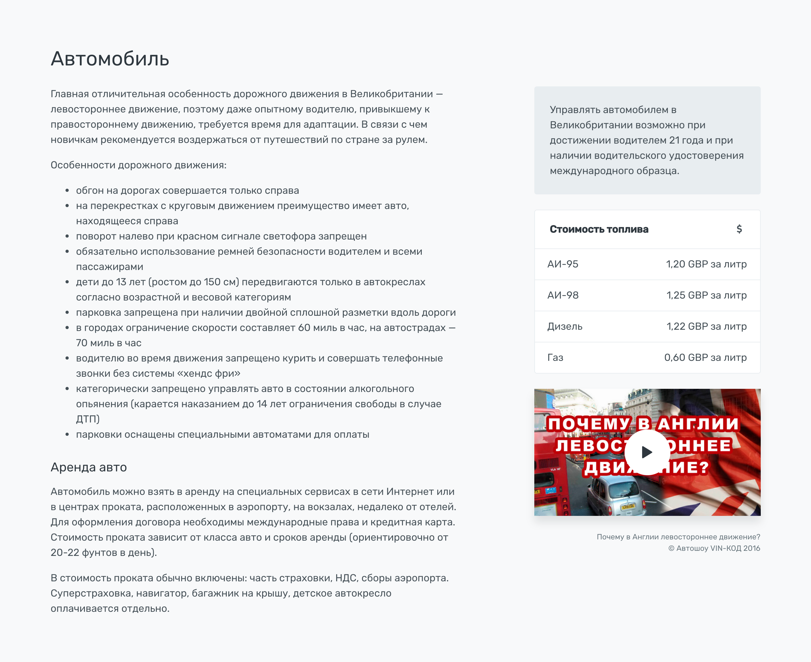

#Секции. Авто

 
Состоит из описания и информационной колонки.

содержит описание () и информационную колонку (можно ли управлять по казахстанскому вод. удостоверению, стоимость топлива в местной валюте, и видео по теме (дороги в стране). 

В описании указываем особенности дорожного движения, платные дороги, топливо, аренда и страхование авто. Подзаголовки выделяем `h5`.

Справа идут блоки:

1. Казахстанские права. Можно ли управлять с ними в данной стране
2. Стоимость топлива. Указываем в местной валюте
2. Видео, например о дорогах в стране, платных магистралях и т.п. Генерируется с помощью [инструмента](https://account.travel/generate/video).

### Разметка

```
.row.justify-content-between
	.col-md-8.col-lg-7
	.col-md-4
```

Полный код секции на скриншоте:

```html
<section id="auto">
    <div class="container">
        <h2>Автомобиль</h2>

        <div class="row justify-content-between">
            <div class="col-md-8 col-lg-7">
                <p>Главная отличительная особенность дорожного движения в Великобритании — левостороннее движение, поэтому даже опытному водителю, привыкшему к правостороннему движению, требуется время для адаптации. В связи с чем новичкам рекомендуется воздержаться от путешествий по стране за рулем.</p>
                <p>Особенности дорожного движения:</p>
                <ul>
                    <li>обгон на дорогах совершается только справа</li>
                    <li>на перекрестках с круговым движением преимущество имеет авто, находящееся справа</li>
                    <li>поворот налево при красном сигнале светофора запрещен</li>
                    <li>обязательно использование ремней безопасности водителем и всеми пассажирами</li>
                    <li>дети до 13 лет (ростом до 150 см) передвигаются только в автокреслах согласно возрастной и весовой категориям</li>
                    <li>парковка запрещена при наличии двойной сплошной разметки вдоль дороги</li>
                    <li>в городах ограничение скорости составляет 60 миль в час, на автострадах — 70 миль в час</li>
                    <li>водителю во время движения запрещено курить и совершать телефонные звонки без системы «хендс фри»</li>
                    <li>категорически запрещено управлять авто в состоянии алкогольного опьянения (карается наказанием до 14 лет ограничения свободы в случае ДТП)</li>
                    <li>парковки оснащены специальными автоматами для оплаты</li>
                </ul>

                <h5 class="mt-3">Аренда авто</h5>
                <p>Автомобиль можно взять в аренду на специальных сервисах в сети Интернет или в центрах проката, расположенных в аэропорту, на вокзалах, недалеко от отелей. Для оформления договора необходимы международные права и кредитная карта. Стоимость проката зависит от класса авто и сроков аренды (ориентировочно от 20-22 фунтов в день). </p>
                <p>В стоимость проката обычно включены: часть страховки, НДС, сборы аэропорта. Суперстраховка, навигатор, багажник на крышу, детское автокресло оплачивается отдельно.</p>
            </div>
            <div class="col-md-4">
                <div class="card">
                    <div class="bg-secondary">
                        <div class="card-body">
                            <p>Управлять автомобилем в Великобритании возможно при достижении водителем 21 года и при наличии водительского удостоверения международного образца.</p>
                        </div>
                    </div>
                </div>

                <div class="card">
                    <div class="card-header">
                        <i class="float-right icon-credit"></i>
                        <span class="h6"><b>Стоимость топлива</b></span>
                    </div>
                    <ul class="list-group list-group-flush">
                        <li class="list-group-item">
                            <div class="d-flex justify-content-between">
                                <div>АИ-95</div>
                                <span>1,20 GBP за литр</span>
                            </div>
                        </li>
                        <li class="list-group-item">
                            <div class="d-flex justify-content-between">
                                <div>АИ-98</div>
                                <span>1,25 GBP за литр</span>
                            </div>
                        </li>
                        <li class="list-group-item">
                            <div class="d-flex justify-content-between">
                                <div>Дизель</div>
                                <span>1,22 GBP за литр</span>
                            </div>
                        </li>
                        <li class="list-group-item">
                            <div class="d-flex justify-content-between">
                                <div>Газ</div>
                                <span>0,60 GBP за литр</span>
                            </div>
                        </li>
                    </ul>
                </div>

                <figure class="figure d-block">
                    <div class="video-cover box-shadow">
                        
                        <div class="video-play-icon">
                            <i class="icon-controller-play"></i>
                        </div>
                        <div class="embed-responsive embed-responsive-16by9">
                            <iframe class="embed-responsive-item" data-src="https://www.youtube.com/embed/FVsD_qvnXno?autoplay=1&rel=0&showinfo=0" webkitallowfullscreen mozallowfullscreen allowfullscreen></iframe>
                        </div>
                    </div>
                    <figcaption class="figure-caption text-right">Почему в Англии левостороннее движение?<br>© Автошоу VIN-КОД 2016</figcaption>
                </figure>
            </div>
        </div>

    </div>
</section>
```
