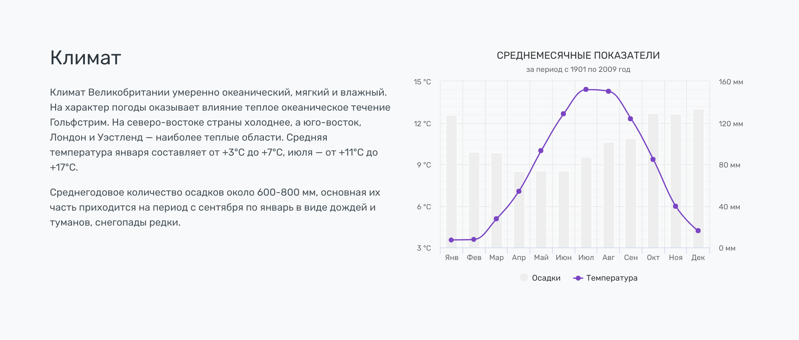

#Секции. Климат


Состоит из двух колонок: слева текстовое описание, справа график, который генерируется автоматически в блоке `#chart-climate`

### Разметка
```html
<section id="climate">
    <div class="container">
        <div class="row">
            <div class="col-lg-6">
                <h2>Климат</h2>
                <p>Климат Великобритании умеренно океанический, мягкий и влажный. На характер погоды оказывает влияние теплое океаническое течение Гольфстрим. На северо-востоке страны холоднее, а юго-восток, Лондон и Уэстленд — наиболее теплые области. Средняя температура января составляет от +3°C до +7°C, июля — от +11°C до +17°C.</p>
                <p>Среднегодовое количество осадков около 600-800 мм, основная их часть приходится на период с сентября по январь в виде дождей и туманов, снегопады редки.</p>
            </div>
            <div class="col-lg-6">
                <div id="chart-climate"></div>
            </div>
        </div>
    </div>
</section>
```