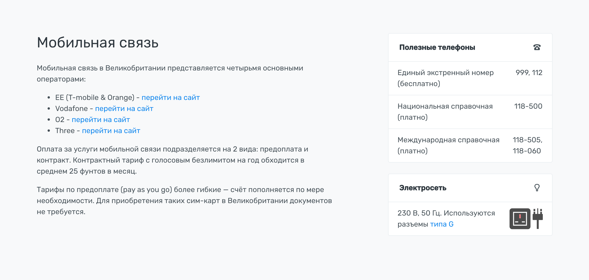

# Секции. Связь


 
Состоит из описания и информационной колонки.

В описании указываем операторов мобильной связи и интеренета. Ссылки на их сайты делаем с `target="_blank"` и `rel="nofollow"`. Возможные подзаголовки выделяем `h5`.

Справа идут блоки:

1. Список телефонов
2. Блок Электросеть. [Подробнее об этом блоке](electric.md)
3. Можно видео о мобильной связи или интернете в стране.

### Разметка

```
.row.justify-content-between
	.col-md-8.col-lg-7
	.col-md-4
```

Полный код секции на скриншоте:

```html
<section id="communication">
    <div class="container">
        <div class="row justify-content-between">
            <div class="col-md-8 col-lg-7">
                <h2>Мобильная связь</h2>
                <p>Мобильная связь в Великобритании представляется четырьмя основными операторами:</p>
                <ul>
                    <li>EE (T-mobile & Orange) - <a href="https://ee.co.uk/" target="_blank" rel="nofollow">перейти на сайт</a></li>
                    <li>Vodafone - <a href="https://www.vodafone.co.uk/" target="_blank" rel="nofollow">перейти на сайт</a></li>
                    <li>O2 - <a href="https://www.o2.co.uk/" target="_blank" rel="nofollow">перейти на сайт</a></li>
                    <li>Three - <a href="http://www.three.co.uk/" target="_blank" rel="nofollow">перейти на сайт</a></li>
                </ul>
                <p>Оплата за услуги мобильной связи подразделяется на 2 вида: предоплата и контракт. Контрактный тариф с голосовым безлимитом на год обходится в среднем 25 фунтов в месяц.</p>
                <p>Тарифы по предоплате (pay as you go)  более гибкие — счёт пополняется по мере необходимости. Для приобретения таких сим-карт в Великобритании документов не требуется.</p>
            </div>

            <div class="col-md-4">
                <div class="card">
                    <div class="card-header">
                        <i class="float-right icon-old-phone"></i>
                        <span class="h6"><b>Полезные телефоны</b></span>
                    </div>
                    <ul class="list-group list-group-flush">
                        <li class="list-group-item">
                            <div class="d-flex justify-content-between">
                                <div>Единый экстренный номер (бесплатно)</div>
                                <span>999,&nbsp;112</span>
                            </div>
                        </li>
                        <li class="list-group-item">
                            <div class="d-flex justify-content-between">
                                <div>Национальная справочная (платно)</div>
                                <span><nobr>118-500</nobr></span>
                            </div>
                        </li>
                        <li class="list-group-item">
                            <div class="d-flex justify-content-between">
                                <div>Международная справочная (платно)</div>
                                <span><nobr>118-505</nobr>,<br><nobr>118-060</nobr></span>
                            </div>
                        </li>
                    </ul>
                </div>

                <div class="card">
                    <div class="card-header">
                        <i class="float-right icon-light-bulb"></i>
                        <span class="h6"><b>Электросеть</b></span>
                    </div>
                    <ul class="list-group list-group-flush">
                        <li class="list-group-item">
                            <div class="d-flex justify-content-between align-items-center">
                                <div>
                                    <nobr>230 В</nobr>, <nobr>50 Гц</nobr>. Используются разъемы <a href="/journal/electric-sockets.html#typeG">типа G</a>
                                </div>
                                <span class="text-right">
                                    
                                </span>
                            </div>
                        </li>
                    </ul>
                </div>
            </div>
        </div>
    </div>
</section>
```
