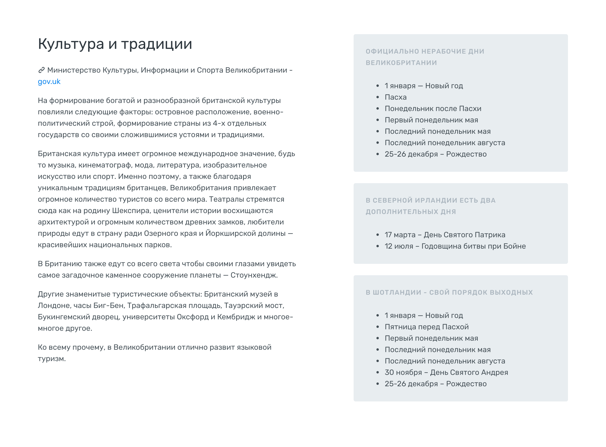

#Секции. Культура


Содержит описание и информационную колонку.

В описании пишем о местных традициях, быте, религии, кухне и т.п.

Справа указываем праздники. Если остается место - подбираем видео например о местной кухне.
### Разметка
На md-экранах колонки одинаковой ширины (6col), на lg-экранах левая 6col, а правая 5col. Промежуток между ними образуется за счет .justify-content-between у обертки.

```
.row.justify-content-between
	.col-md-6
	.col-md-6.col-lg-5
```
Если в правую колонку надо вставить видео - [генерируем код](https://account.travel/generate/video) и вставляем его после последнего .card


Полный код секции на скриншоте:

```html
<section id="culture" class="bg-white">
    <div class="container">
        <div class="row justify-content-between">
            <div class="col-md-6">
                <h2>Культура и традиции</h2>
                <p><i class="icon-link"></i> Министерство Культуры, Информации и Спорта Великобритании -  <a href="http://www.gov.uk/government/organisations/department-for-digital-culture-media-sport" target="_blank">gov.uk</a></p>
                <p>На формирование богатой и разнообразной британской культуры повлияли следующие факторы: островное расположение, военно-политический строй, формирование страны из 4-х отдельных государств со своими сложившимися устоями и традициями.</p>
                <p>Британская культура имеет огромное международное значение, будь то музыка, кинематограф, мода, литература, изобразительное искусство или спорт. Именно поэтому, а также благодаря уникальным традициям британцев, Великобритания привлекает огромное количество туристов со всего мира. Театралы стремятся сюда как на родину Шекспира, ценители истории восхищаются архитектурой и огромным количеством древних замков, любители природы едут в страну ради Озерного края и Йоркширской долины — красивейших национальных парков.</p>
                <p>В Британию также едут со всего света чтобы своими глазами увидеть самое загадочное каменное сооружение планеты — Стоунхендж.</p>
                <p>Другие знаменитые туристические объекты: Британский музей в Лондоне, часы Биг-Бен, Трафальгарская площадь, Тауэрский мост, Букингемский дворец, университеты Оксфорд и Кембридж и многое-многое другое.</p>
                <p>Ко всему прочему, в Великобритании отлично развит языковой туризм.</p>
            </div>
            <div class="col-md-6 col-lg-5">
                <div class="card bg-secondary">
                    <div class="card-body">
                        <h6 class="title-decorative">Официально нерабочие дни Великобритании</h6>
                        <ul>
                            <li>1 января — Новый год</li>
                            <li>Пасха</li>
                            <li>Понедельник после Пасхи</li>
                            <li>Первый понедельник мая </li>
                            <li>Последний понедельник мая</li>
                            <li>Последний понедельник августа</li>
                            <li>25-26 декабря – Рождество</li>
                        </ul>
                    </div>
                </div>
                <div class="card bg-secondary">
                    <div class="card-body">
                        <h6 class="title-decorative">В Северной Ирландии есть два дополнительных дня</h6>
                        <ul>
                            <li>17 марта – День Святого Патрика</li>
                            <li>12 июля – Годовщина битвы при Бойне </li>
                        </ul>
                    </div>
                </div>
                <div class="card bg-secondary">
                    <div class="card-body">
                        <h6 class="title-decorative">В Шотландии - свой порядок выходных</h6>
                        <ul>
                            <li>1 января — Новый год</li>
                            <li>Пятница перед Пасхой</li>
                            <li>Первый понедельник мая</li>
                            <li>Последний понедельник мая </li>
                            <li>Последний понедельник августа</li>
                            <li>30 ноября – День Святого Андрея</li>
                            <li>25-26 декабря – Рождество</li>
                        </ul>
                    </div>
                </div>
            </div>
        </div>
    </div>
</section>
```