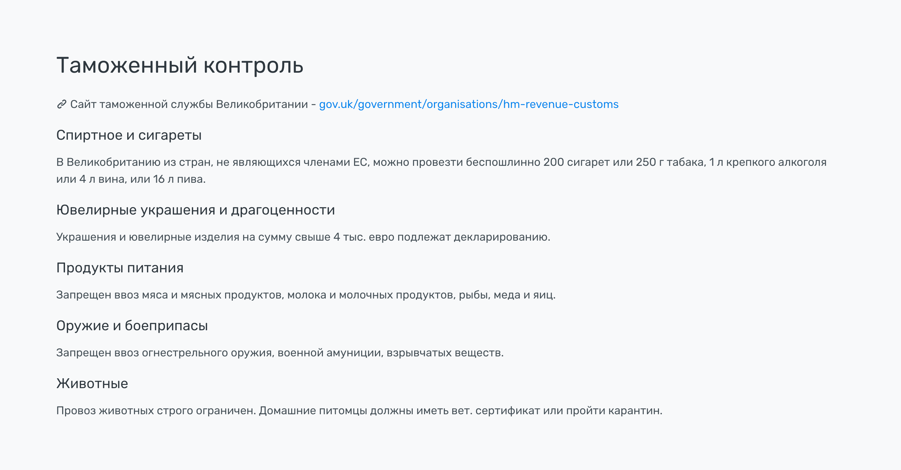

# Секции. Таможня


Пока блок состоит только из текстового описания, без информационных колонок.

Подзаголовки выделяем `h5`, ссылки на внешние ресурсы `target="blank"` и `rel="nofollow"`


### Разметка

```html
<section id="custom">
    <div class="container">
        <h2>Таможенный контроль</h2>

        <p><i class="icon icon-link"></i> Сайт таможенной службы Великобритании - <a href="http://www.gov.uk/government/organisations/hm-revenue-customs" target="_blank" rel="nofollow">gov.uk/government/organisations/hm-revenue-customs</a></p>

        <h5>Спиртное и сигареты</h5>
        <p>В Великобританию из стран, не являющихся членами ЕС, можно провезти беспошлинно 200 сигарет или 250 г табака, 1 л крепкого алкоголя или 4 л вина, или 16 л пива.</p>

        <h5>Ювелирные украшения и драгоценности</h5>
        <p>Украшения и ювелирные изделия на сумму свыше 4 тыс. евро подлежат декларированию.</p>

        <h5>Продукты питания</h5>
        <p>Запрещен ввоз мяса и мясных продуктов, молока и молочных продуктов, рыбы, меда и яиц.</p>

        <h5>Оружие и боеприпасы</h5>
        <p>Запрещен ввоз огнестрельного оружия, военной амуниции, взрывчатых веществ.</p>

        <h5>Животные</h5>
        <p>Провоз животных строго ограничен. Домашние питомцы должны иметь вет. сертификат или пройти карантин.</p>
    </div>
</section>
```
