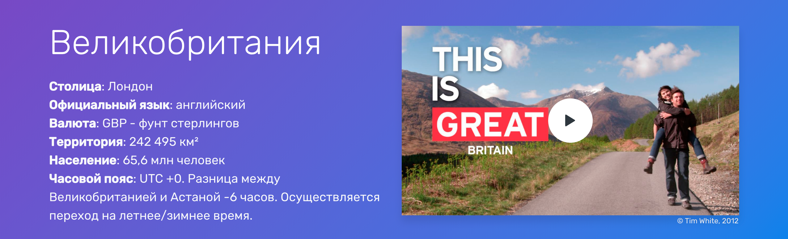

# Шапка

Содержит сводные данные и короткое видео по стране. 

Цель этой секции - задержать внимание пользователя красивой картинкой и качественным видео, чтобы человек заинтересовался и больше времени провел на странице.

### Подбор видео
Видео для шапки должно быть коротким и содержать моменты, по которым можно явно идентифицировать страну (известные достопримечательности, уникальная архитектура городов, запоминающиеся места). 

Проще всего такое видео найти на [vimeo.com](https://vimeo.com/) - указываем в поисковой строке название страны на английском (например: UK, slovenia, italy, greece и т.п.). Слева с фильтре выбираем категорию "Travel" и длительность "Short (<4:00)".

Среди найденных выбираем то, которое наиболее подходит по цели. Далее копируем ссылку и [генерируем код](https://account.travel/generate/video) с выбранной галочкой "Для шапки".

Важный момент - после вставки видео проверяем результат. Хорошо, если заставочная картинка будет качественной. В противном случае лучше поискать другое видео, но если другого нет - оставляем найденное и при сдаче работы пишем, что у него надо поставить другую картинку.