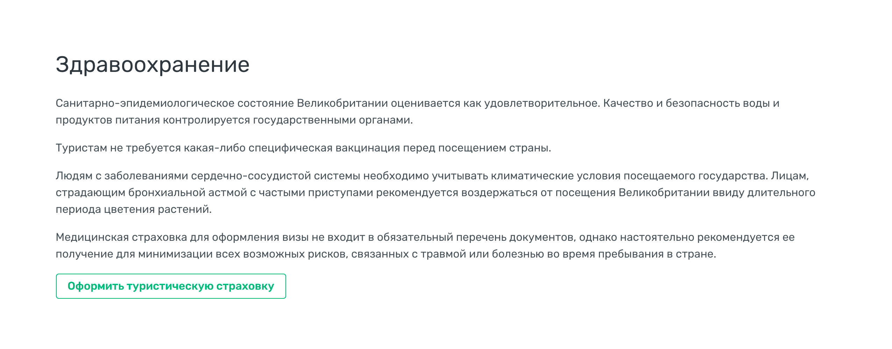

#Секции. Здравоохранение


Пока просто текстовый блок, без информационных колонок и видео.

Если в стране требуется или рекомендуется страховка - показываем кнопку "Оформить туристическую страховку".

### Разметка

```html
<section id="health" class="bg-white">
    <div class="container">
        <h2>Здравоохранение</h2>

        <p>Санитарно-эпидемиологическое состояние Великобритании оценивается как удовлетворительное. Качество и безопасность воды и продуктов питания контролируется государственными органами.</p>
        <p>Туристам не требуется какая-либо специфическая вакцинация перед посещением страны.</p>
        <p>Людям с заболеваниями сердечно-сосудистой системы необходимо учитывать климатические условия посещаемого государства.  Лицам, страдающим бронхиальной астмой с частыми приступами рекомендуется воздержаться от посещения Великобритании ввиду длительного периода цветения растений.</p>
        <p>Медицинская страховка для оформления визы не входит в обязательный перечень документов, однако настоятельно рекомендуется ее получение для минимизации всех возможных рисков, связанных с травмой или болезнью во время пребывания в стране. </p>

        <a href="https://medical.account.travel" class="btn btn-outline-success">Оформить туристическую страховку</a>
    </div>
</section>
```
