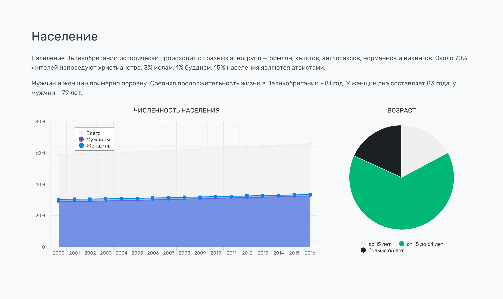

#Секции. Население


Состоит из текстового описания и графиков, которые генерируются автоматически.

В описании указываем этнический состав, разделение по религиям в стране, соотношение мужчин/женщин и среднюю продолжительность жизни.

На графиках показывается изменение численности населения в стране по годам, а также срез людей по возрасту.


### Разметка
HTML

```html
<section id="population">
    <div class="container">
        <h2>Население</h2>
        <p>Население Великобритании исторически происходит от разных этногрупп — римлян, кельтов, англосаксов, норманнов и викингов. Около 70% жителей исповедуют христианство, 3% ислам, 1% буддизм, 15% населения являются атеистами.</p>
        <p>Мужчин и женщин примерно поровну. Средняя продолжительность жизни в Великобритании - 81 год. У женщин она составляет 83 года, у мужчин – 79 лет.</p>
        <div class="row mb-3">
            <div class="col-md-8">
                <div id="chart-population"></div>
            </div>
            <div class="col-md-4">
                <div id="chart-population-ages"></div>
            </div>
        </div>
    </div>
</section>
```

PHP (заменяется блок графиков)

```php
<section id="population">
    <div class="container">
        <h2>Население</h2>
        <p>Население Великобритании исторически происходит от разных этногрупп — римлян, кельтов, англосаксов, норманнов и викингов. Около 70% жителей исповедуют христианство, 3% ислам, 1% буддизм, 15% населения являются атеистами.</p>
        <p>Мужчин и женщин примерно поровну. Средняя продолжительность жизни в Великобритании - 81 год. У женщин она составляет 83 года, у мужчин – 79 лет.</p>
        <?= $this->render('_population') ?>
    </div>
</section>
```