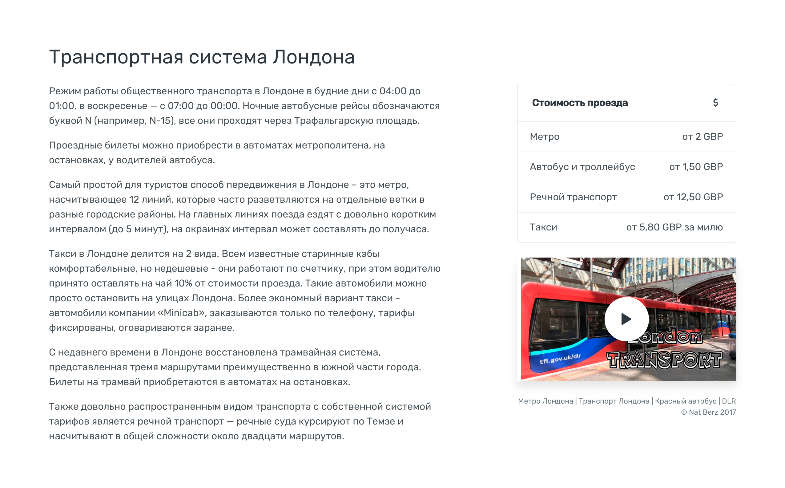

# Секции. Транспорт

 
Состоит из описания и информационной колонки.

Хорошо, если описание разбито на пункты: Автобус, Такси, Метро. Эти подзаголовки выделяем `h5`.

Справа идут блоки:

1. Cтоимость проезда. Указываем в местной валюте
2. Видео о транспорте, например как покупать билеты, описание местного метро и т.п. Генерируется с помощью [инструмента](https://account.travel/generate/video).

### Разметка

```
.row.justify-content-between
	.col-md-8.col-lg-7
	.col-md-4
```

Полный код секции на скриншоте:

```html
<section id="transport" class="bg-white">
    <div class="container">
        <h2>Транспортная система Лондона</h2>

        <div class="row justify-content-between">
            <div class="col-md-8 col-lg-7">
                <p>Режим работы общественного транспорта в Лондоне в будние дни с 04:00 до 01:00, в воскресенье — с 07:00 до 00:00. Ночные автобусные рейсы обозначаются буквой N (например, N-15), все они проходят через Трафальгарскую площадь.</p>
                <p>Проездные билеты можно приобрести в автоматах метрополитена, на остановках, у водителей автобуса.</p>
                <p>Самый простой для туристов способ передвижения в Лондоне – это метро, насчитывающее 12 линий, которые часто разветвляются на отдельные ветки в разные городские районы. На главных линиях поезда ездят с довольно коротким интервалом (до 5 минут), на окраинах интервал может составлять до получаса.</p>
                <p>Такси в Лондоне делится на 2 вида. Всем известные старинные кэбы комфортабельные, но недешевые - они работают по счетчику, при этом водителю принято оставлять на чай 10% от стоимости проезда. Такие автомобили можно просто остановить на улицах Лондона. Более экономный вариант такси - автомобили компании «Minicab», заказываются только по телефону, тарифы фиксированы, оговариваются заранее.</p>
                <p>С недавнего времени в Лондоне восстановлена трамвайная система, представленная тремя маршрутами преимущественно в южной части города. Билеты на трамвай приобретаются в автоматах на остановках.</p>
                <p>Также довольно распространенным видом транспорта с собственной системой тарифов является речной транспорт — речные суда курсируют по Темзе и насчитывают в общей сложности около двадцати маршрутов.</p>
            </div>
            <div class="col-md-4">
                <div class="card">
                    <div class="card-header">
                        <i class="float-right icon-credit"></i>
                        <span class="h6"><b>Стоимость проезда</b></span>
                    </div>
                    <ul class="list-group list-group-flush">
                        <li class="list-group-item">
                            <div class="d-flex justify-content-between">
                                <div>Метро</div>
                                <span>от 2 GBP</span>
                            </div>
                        </li>
                        <li class="list-group-item">
                            <div class="d-flex justify-content-between">
                                <div>Автобус и троллейбус</div>
                                <span>от 1,50 GBP</span>
                            </div>
                        </li>
                        <li class="list-group-item">
                                <div class="d-flex justify-content-between">
                                    <div>Речной транспорт</div>
                                    <span>от 12,50 GBP</span>
                                </div>
                            </li>    
                        <li class="list-group-item">
                            <div class="d-flex justify-content-between">
                                <div>Такси</div>
                                <span>от 5,80 GBP за милю</span>
                            </div>
                        </li>
                    </ul>
                </div>

                <figure class="figure d-block">
                    <div class="video-cover box-shadow">
                        
                        <div class="video-play-icon">
                            <i class="icon-controller-play"></i>
                        </div>
                        <div class="embed-responsive embed-responsive-16by9">
                            <iframe class="embed-responsive-item" data-src="https://www.youtube.com/embed/Cdqxr1HnudY?autoplay=1&rel=0&showinfo=0" webkitallowfullscreen mozallowfullscreen allowfullscreen></iframe>
                        </div>
                    </div>
                    <figcaption class="figure-caption text-right">Метро Лондона | Транспорт Лондона | Красный автобус | DLR<br>© Nat Berz 2017</figcaption>
                </figure>
            </div>
        </div>
    </div>
</section>
```
